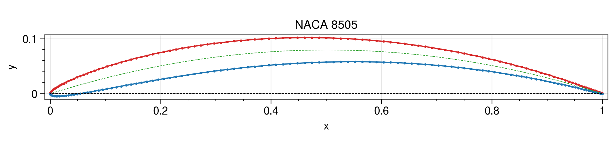

# Airfoil

Package to build, parameterize and manipulate airfoils.

Some parts of this software are borrowed and derived from [1]. These are copyright © 2021 University of Michigan.




## Canonical Airfoil Convention

- Coordinates start at the upper TE and end at the lower TE.
- Number of points:
    - Total: $n$, *odd*
    - Upper half: $(n + 1) / 2$ (from upper TE to upper LE)
    - Lower half: $(n + 1) / 2 - 1$ (from "LE+1" to lower TE, however, `af.lower` includes the LE point)
- x-coordinates of upper/lower must strictly monotonically decrease/increase.

## Installation

```bash
pip install git+https://github.zhaw.ch/hacs/airfoil
```


## References

[1] https://github.com/mdolab/prefoil